<div class="MCWHeader1">
Azure Blockchain
</div>

<div class="MCWHeader2">
Hands-on lab step-by-step
</div>

<div class="MCWHeader3">
December 2018
</div>

Information in this document, including URL and other Internet Web site references, is subject to change without notice. Unless otherwise noted, the example companies, organizations, products, domain names, e-mail addresses, logos, people, places, and events depicted herein are fictitious, and no association with any real company, organization, product, domain name, e-mail address, logo, person, place or event is intended or should be inferred. Complying with all applicable copyright laws is the responsibility of the user. Without limiting the rights under copyright, no part of this document may be reproduced, stored in or introduced into a retrieval system, or transmitted in any form or by any means (electronic, mechanical, photocopying, recording, or otherwise), or for any purpose, without the express written permission of Microsoft Corporation.

Microsoft may have patents, patent applications, trademarks, copyrights, or other intellectual property rights covering subject matter in this document. Except as expressly provided in any written license agreement from Microsoft, the furnishing of this document does not give you any license to these patents, trademarks, copyrights, or other intellectual property.

The names of manufacturers, products, or URLs are provided for informational purposes only and Microsoft makes no representations and warranties, either expressed, implied, or statutory, regarding these manufacturers or the use of the products with any Microsoft technologies. The inclusion of a manufacturer or product does not imply endorsement of Microsoft of the manufacturer or product. Links may be provided to third party sites. Such sites are not under the control of Microsoft and Microsoft is not responsible for the contents of any linked site or any link contained in a linked site, or any changes or updates to such sites. Microsoft is not responsible for webcasting or any other form of transmission received from any linked site. Microsoft is providing these links to you only as a convenience, and the inclusion of any link does not imply endorsement of Microsoft of the site or the products contained therein.

©  2018 Microsoft Corporation. All rights reserved.

Microsoft and the trademarks listed at <https://www.microsoft.com/en-us/legal/intellectualproperty/Trademarks/Usage/General.aspx> are trademarks of the Microsoft group of companies. All other trademarks are property of their respective owners.

**Contents**

<!-- TOC -->
- [Azure Blockchain hands-on lab step-by-step](#azure-blockchain-hands-on-lab-step-by-step)
    - [Abstract and learning objectives](#abstract-and-learning-objectives)
        - [Overview](#overview)
    - [Solution architecture](#solution-architecture)
    - [Requirements](#requirements)
    - [Exercise 1: Setup Azure Active Directory Tenant](#exercise-1-setup-azure-active-directory-tenant)
        - [Task 1: Create Azure AD Tenant](#task-1-create-azure-ad-tenant)
        - [Task 2: Create App Registration](#task-2-create-app-registration)
        - [Task 3: Create Azure AD Administrator Group](#task-3-create-azure-ad-administrator-group)
        - [Task 4: Add Administrator User](#task-4-add-administrator-user)
    - [Exercise 2: Deploy Azure Blockchain Workbench](#exercise-2-deploy-azure-blockchain-workbench)
        - [Task 1: Generate SSH Public / Private Key](#task-1-generate-ssh-public--private-key)
        - [Task 2: Deploy Azure Blockchain Workbench](#task-2-deploy-azure-blockchain-workbench)
        - [Task 3: Get Azure Blockchain Workbench Web Client URL](#task-3-get-azure-blockchain-workbench-web-client-url)
        - [Task 4: Setup Azure AD Configuration](#task-4-setup-azure-ad-configuration)
        - [Task 5: Configure the Reply URL](#task-5-configure-the-reply-url)
    - [Exercise 3: Check Blockchain Workbench Web Client Deployment](#exercise-3-check-blockchain-workbench-web-client-deployment)
        - [Task 1: Open Blockchain Workbench Web Client](#task-1-open-blockchain-workbench-web-client)
    - [Exercise 4: Create Smart Contract](#exercise-4-create-smart-contract)
        - [Task 1: Code TelemetryCompliance Smart Contract](#task-1-code-telemetrycompliance-smart-contract)
        - [Task 2: Create the Configuration Files](#task-2-create-the-configuration-files)
        - [Task 3: Deploy the Smart Contract](#task-3-deploy-the-smart-contract)
    - [Exercise 5: Assign Users to Contract Personas](#exercise-5-assign-users-to-contract-personas)
        - [Task 1: Create Users in Azure AD](#task-1-create-users-in-azure-ad)
        - [Task 2: Create User Assignments](#task-2-create-user-assignments)
    - [Exercise 6: Create and Process an Instance of the Smart Contract](#exercise-6-create-and-process-an-instance-of-the-smart-contract)
        - [Task 1: Create Contract Instance](#task-1-create-contract-instance)
        - [Task 2: Transfer Responsibility to Contoso Shipping](#task-2-transfer-responsibility-to-contoso-shipping)
        - [Task 3: Ingest Simulated Device Telemetry](#task-3-ingest-simulated-device-telemetry)
        - [Task 4: Accept Responsibility to Blockchain Shipping](#task-4-accept-responsibility-to-blockchain-shipping)
        - [Task 5: Final Delivery to Northwind Traders](#task-5-final-delivery-to-northwind-traders)
        - [Task 6: Audit Smart Contract for Compliance](#task-6-audit-smart-contract-for-compliance)
    - [After the hands-on lab](#after-the-hands-on-lab)
        - [Task 1: Delete Resources](#task-1-delete-resources)
        - [Task 2: Delete Azure AD Tenant](#task-2-delete-azure-ad-tenant)

<!-- /TOC -->

# Azure Blockchain hands-on lab step-by-step

## Abstract and learning objectives

In this lab, you will learn how to build and configure an Internet of Things (IoT) Audit Solution using Azure blockchain services. You will collect device telemetry using Azure IoT Hub and use Ethereum blockchain ledger to enforce contract specifics related to conditions during transport of goods. Specifically, the IoT devices will report temperature and humidity data that will be validated through the Smart Contracts against agreed upon acceptable ranges.

At the end of this hands-on lab, you will be better able to build a solution to deploy and configure Azure Blockchain Workbench, write and deploy Ethereum Smart Contracts with Solidity, and integrate both IoT and the blockchain ledger into a single solution.

### Overview

In this lab, students will deploy a Blockchain solution using the Azure Blockchain Workbench. They will then configure authentication and authorization of multiple users using Azure AD. Then a Smart Contract to track and enforce compliance of a package in the Supply Chain will be implemented within the Blockchain written in Solidity. Finally, the student will create an instance of the Smart Contract on the Blockchain, go through the business workflow defined in the Smart Contract. The student will also feed IoT device sensor telemetry into the Blockchain Smart Contract to validate compliance of the contract using a simulated device account.

## Solution architecture


## Requirements

1. An Azure Subscription

## Exercise 1: Setup Azure Active Directory Tenant

Duration: 15 minutes

In this exercise, the student will configure a new Azure AD Tenant that the Azure Blockchain Workbench will use to authenticate users.

The authentication and authorization of users in the Blockchain Workbench is performed using an Azure Active Directory (AAD) Tenant. To reduce the potential for conflict, a new AAD Tenant will be created for use with this lab.

### Task 1: Create Azure AD Tenant

1. Login to the Azure Portal at <http://portal.azure.com> using the credentials for your Azure Subscription that you will be using to deploy the resources created within this lab.

2. In the navigation on the left, click **+Create a resource**, then **Identity**, and click **Azure Active Directory**.

3. On the **Create directory** blade, enter the following values, and click **Create**:

    a.  Organization name: **Northwind Traders**

    b.  Initial domain name: **Enter a unique domain name**.

    c.  Country or region: **Select your country / region**.

    

4. Wait for the new directory to be created. This should only take a minute. 

    

5. Within the **Create directory** blade, click on the link that states "*Click here, to manage your new directory*". This will take to directly to the newly created directory.

    

6. On the **Azure Active Directory** blade, click on **Custom domain names**.

    

7. Copy the **Domain Name** for the **Azure Active Directory Tenant**. This will be used later.

    

### Task 2: Create Azure AD Administrator Group

1. On the **Azure Active Directory** blade, click on **Groups**.

    

2. Click **+New group**.

    

3. On the **Group** blade, enter the following values, then click **Create**:

    a. Group type: **Security**

    b. Group name: **Administrator**

    c. Membership type: **Assigned**

    

### Task 3: Add Administrator User

1. On the **Azure Active Directory** blade, click on **Users**.

    

2. On the **All users** pane, click on the Azure AD User that you are currently logged into the Azure Portal with.

    

3. On the **User** blade, click on **Groups**.

    

4. Click the **+ Add** button to begin adding the Azure AD User to the Administrator group.

    

5. On the **Select Group** pane, click the **Administrator** group, then click **Select**.

    

6. On the **Azure Active Directory** blade, click on **Enterprise applications**.

    

7. On the **Enterprise applications - All applications** pane, click on the **Azure Blockchain Workbench Web Client** name in the list.

    

8. On the **Enterprise Application** blade for the Azure Blockchain Workbench Web Client, click on **Users and groups**.

    

9. On the **Users and groups** pane, click the **+ Add user** button.

    

10. On the **Add Assignment** blade, click **Users**, select the User you're currently logged into the Azure Portal with, then click **Select**.

    

11. Verify the **Role** is set to **Administrator**, then click **Assign**.

    

## Exercise 2: Deploy Azure Blockchain Workbench

Duration: 60 - 90 minutes

In this exercise, the student will deploy and setup Azure Blockchain Workbench.

### Task 1: Generate SSH Public / Private Key

1. Run **PuTTY Key Generator** (puttygen.exe):

    <https://www.chiark.greenend.org.uk/~sgtatham/putty/latest.html>

2. Click **Generate** to begin generating a new public/private key pair, and follow the instructions to move the mouse to generate randomness.

    

3. Click **Save public key** to save the generated Public Key to a file.

    

4. In the **Save public key as:** dialog, choose a folder location to save the Public Key file, then name the file **PublicKey.txt** and click **Save**.

    

5. Click **Save private key** to save the generated Private Key to a file.

    

6. When prompted "*Are you sure you want to save this key without a passphrase to protect it?",* click **Yes**. Normally, you would set a passphrase for better security of the Private Key, but for this lab you can skip that.

    

7. On the **Save private key as:** dialog, choose the same folder used earlier, then name the Private Key file **PrivateKey.ppk** and click **Save**.

    

8. You can now close PuTTY Key Generator, but remember where the Key files have been saves. They will need needed in a future step.

### Task 2: Deploy Azure Blockchain Workbench

1.  Login to the Azure Portal at <http://portal.azure.com> using the credentials for your Azure Subscription that you will be using to deploy the resources created within this lab.

2.  Click on the **Directory and Subscription filter** button in the top menu of the Azure Portal, and ensure that the Azure Active Directory for your Azure Subscription is selected. When previously configuring the **Northwind Traders Directory**, it will currently be selected, so you will need to click on the appropriate Directory for your Azure Subscription to change Directories and be able to continue with the lab.

    

3.  Now that you made sure to select the Directory for your Azure Subscription, click **+Create a resource** to begin provisioning a new resource.

4.  In the **Marketplace Search** box type **Azure Blockchain Workbench**, then press **Enter**.

    

5.  In the search results, click on **Azure Blockchain Workbench**.

    

6.  Click **Create**.

    

7.  On the **Basic** step of the **Create Azure Blockchain Workbench** blade, enter the following values, and click **OK**:

    a.  Resource prefix: **Choose a prefix to use as the base for naming resources**. *Tip: Using the first letter of your first name, and the first 3 letters of your last name (ex: jdoe) is an easy way to make this unique.*

    b.  VM user name: **demouser**

    c. Authentication type: **SSH public key**

    d.  SSH public key: **Paste in the contents of the PublicKey.txt key file that was previously created**.
    
    

    e.  Database password: **Demo@pass123**

    f.  Deployment Region: **Choose the Azure Region closest to you.**

    g.  Resource group: create a new resource group named **BlockchainLab**

    h.  Location: **Choose the same Azure Region that was chosen for Deployment Region.**

    

8. On the **Advanced Settings** step, leave the default values, and click **OK**.

    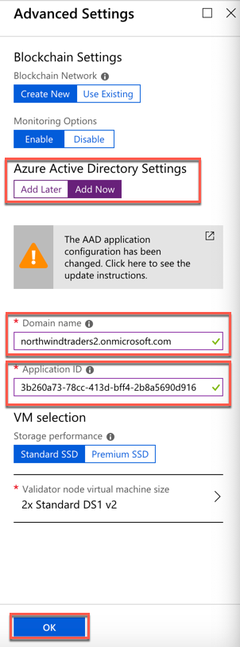

9.  On the **Summary** step, click **OK** once validation is complete.

     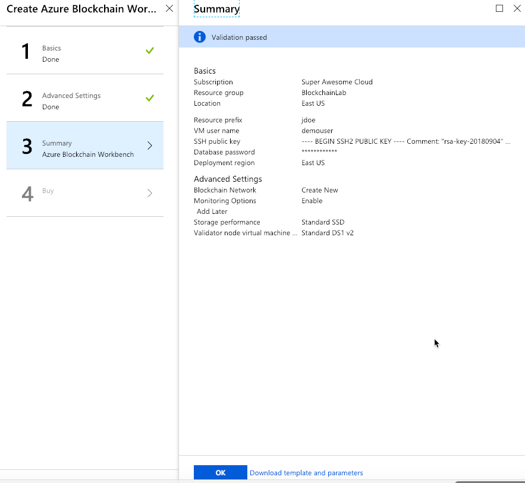

10. On the **Create** step, click **Create**.

    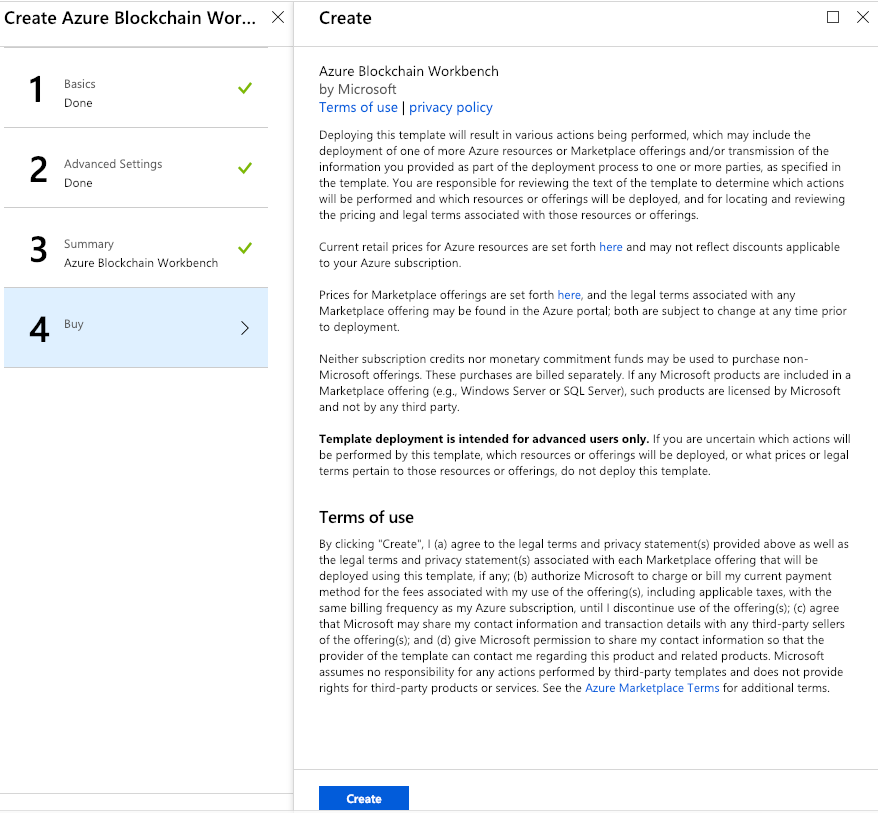

11. Wait for **Blockchain Workbench** to deploy. This can take approximately 60 - 90 minutes to complete. Wait for this to finish
    before moving on.

    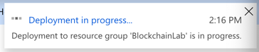

### Task 3: Get Azure Blockchain Workbench Web Client URL

1. Click on **Resource groups** in the navigation on the left-side of the Azure Portal, and click on the **BlockchainLab** resource group in the list.

    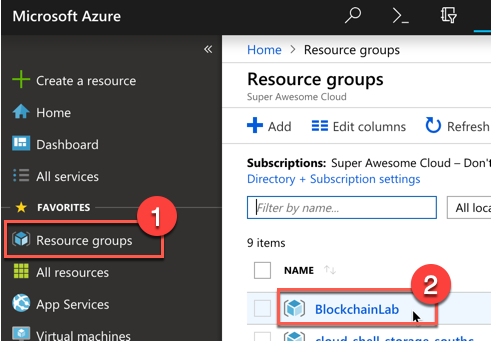

2. On the Resource group blade for the **BlockchainLab**, click on the **TYPE** column header to sort the list of resources within the Resource Group.

    

3. Now with the **App Service** resources at the top of the list, click on the App Service resource that does *NOT* have "-api" at the end of the name. The App Service to click should be the first one when resources are sorted by TYPE.

    

4. On the **App Service** blade, copy the **URL** for the Web App for future use. It's recommended that you open Notepad and save this in a .txt file for future reference.

    

### Task 4: Setup Azure AD Configuration

1. In a browser, navigate to the Blockchain Workbench Web Client URL.

2. Click the **Copy** button to copy the command that is displayed, then click the **Launch Cloud Shell** button to launch the Azure Cloud Shell.

    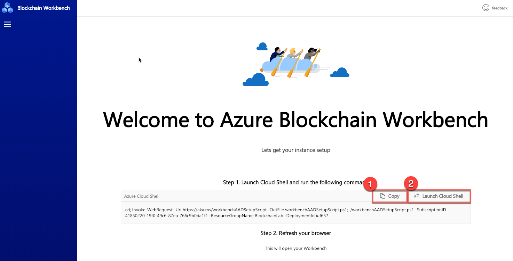

3. Select the Azure Subscription where the Blockchain Workbench was provisioned.

    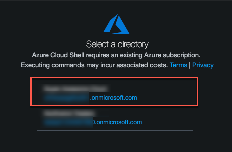

4. In the Azure Cloud Shell, paste in the command that was copied and run it.

    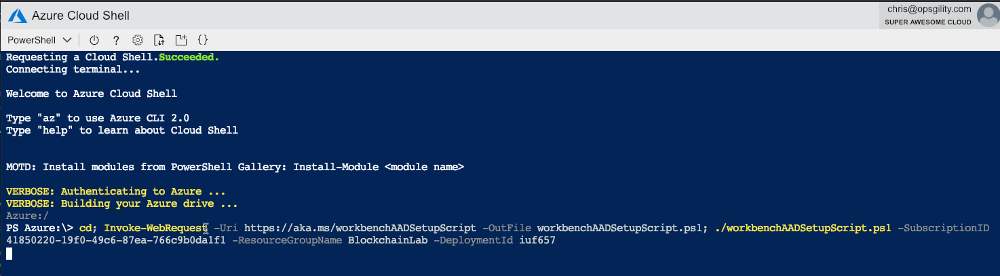

5. When prompted, enter the Azure AD Tenant ID to use for the Blockchain Workbench.

    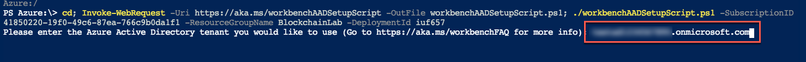

6. When prompted, navigate to <https://microosft.com/devicelogin> and enter the code displayed at the command prompt to sign in the Azure console with the Azure Subscription.

    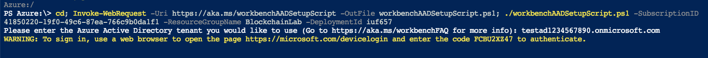

7. When the script has finished executing it will output some status information such as the Application Name and ID it registered in Azure AD, as well as a **SUCCESS** message that it completed successfully.

    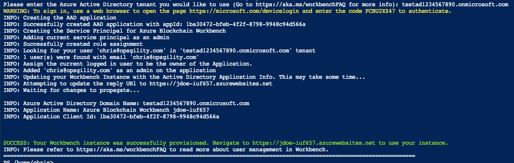

### Task 5: Configure the Reply URL

1. Login to the Azure Portal at <http://portal.azure.com> using the credentials for your Azure Subscription that you will be using to deploy the resources created within this lab.

2. Click on the **Directory and Subscription filter** button at the top of the Azure Portal, then select the **Northwind Traders** Azure AD Tenant that was created for this lab.

    

3. In the navigation on the left-side of the Azure Portal, click on **Azure Active Directory**.

    

4. On the **Azure Active Directory** blade for the Northwind Traders Directory, click on **App registrations**.

    

5. On the **App registrations** pane, click the **View all applications** button to show all App registrations.

    

6. Click on the **Azure Blockchain Workbench** app registration in the list.

    

7. On the **Registered app** blade, click on **Reply URLs** under Settings.

    

8. Add a new **Reply URL** and paste in the **URL** that was copied from the **Azure Blockchain Workbench Web App** previously, then click **Save**. Be sure that it's an "http**s**://*"* URL.

    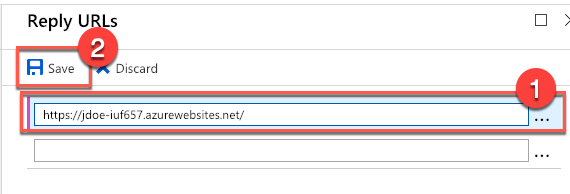

9. In the browser, navigate to the **Blockchain Workbench Web App URL**. When prompted, accept the Permissions request to grant consent for the web application with Azure AD.

    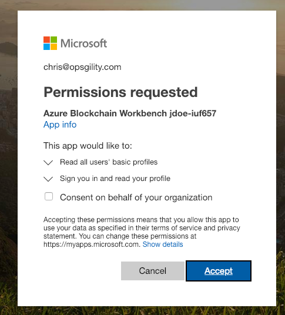

10. After consent has been granted the Blockchain Workbench web app can be used.

## Exercise 3: Check Blockchain Workbench Web Client Deployment

Duration: 15 minutes

In this exercise, the student will access the Azure Blockchain Workbench Web Client to make sure the deployment is working as expected. The student will also check the Ethereum network status.

### Task 1: Open Blockchain Workbench Web Client

1. Open a new browser window in incognito or private browser mode, then navigate to the URL for the **Blockchain Workbench Web Client**.

2. When prompted, login to the site using your **Microsoft Account** that you previously added to the **Administrator** Group within Azure AD.

    

3. Once logged in you will see the dashboard view of the **Azure Blockchain Workbench Web Client**.

    

## Exercise 4: Create Smart Contract

Duration: 30 minutes

In this exercise, you will create a new Smart Contract that targets the Ethereum blockchain ledger that is written in the Solidity programming
language.

### Task 1: Code TelemetryCompliance Smart Contract

1. Open **Visual Studio Code**, click **File** followed by **Open Folder...**

    

2. In the **Open Folder** dialog, select the **C:/HOL** folder. If the folder does not exist yet, please create it.

    

3. Expand the **Explorer** pane, then hover over the **HOL** folder, and click the **New File** button.

    

4. Type in **TelemetryCompliance.sol** as the file name.

    

5. Open the **TelemetryCompliance.sol** file, then add the following line to the top of the file. This first line specifies the source code is written for Solidity version 0.4.20 or newer that does not break functionality up to, but not including version 0.5.0. This is to ensure the Smart Contract does not behave differently with a new compiler version.

    ```
    pragma solidity ^0.4.25;
    ```

7. Next, add the beginning of the Smart Contract. The type name for this contract will be TelemetryCompliance.

    ```
    contract TelemetryCompliance
    {
        // insert smart contract code here
    }
    ```

8. Next, the functionality of the Smart Contract needs to be filled out. Start this by adding the following **enum StateType** definition within the **TelemetryCompliance** class.

    ```
    enum StateType {
        Creating,
        Created,
        TransitionRequestPending,
        InTransit,
        FinalDelivery,
        Completed,
        OutOfCompliance
    }
    ```

9. Add the **State** property of type **StateType**. This will be used through-out the lifetime of the Smart Contract to store the appropriate state of the contact.

    ```
    StateType public State;
    ```

10. Add the following additional properties to the Smart Contract. These properties will be used to track the different individuals who will be participating in the workflow.

    ```
    address public InitiatingCounterparty;
    address public Counterparty;
    address public PreviousCounterparty;
    address public RequestedCounterparty;
    address public Device;
    address public SupplyChainOwner;
    address public SupplyChainObserver;
    ```

    The "**Counterparty**" properties that were added are used to reflect the different individuals' organizations that have had, do currently     have, or are about to have possession of a package.

    There is also a "**Device**" property to provide telemetry information on humidity and temperature which will be evaluated by the Smart Contract. The contract is setup so that this ca work with both a real device and Azure IoT Hub, or a person simulating the device as a logged in user.

    The "**SupplyChainOwner**" represents the organization that is shipping the package through the supply chain.

    The "**SupplyChainObserver**" represents an organization that does not participate in the supply chain but may be monitoring it. An example of an observer could be a government agency.

    >**Note**: The SupplyChainObserver is included in the properties of the Smart Contract, but it's not being implemented in this lab.

11. Add the following properties to be used to enforce the package will be maintained in an environment with minimum and maximum threshold readings (min and max) for both Temperature and Humidity. There are also properties that record the last reported values and the timestamp for the last sensor update; as a Unix epoch date value versus a formatted date and time.

    ```
    int public MinHumidity;
    int public MaxHumidity;
    int public MinTemperature;
    int public MaxTemperature;
    int public LastHumidity;
    int public LastTemperature;
    uint public LastSensorUpdateTimestamp;
    ```

12. Next, add some properties to provide information on the compliance status of the contract. The **ComplianceStatus** property will store whether the monitored sensor values are out of compliance. The **enum** **SensorType** will be used along with the **ComplianceSensorType** property to store information on the specific sensor reading recorded. The **ComplianceSensorReading** property will store the actual value of the sensor reading. Also, the **ComplianceDetail** property will store additional information about the compliance.

    ```
    enum SensorType { None, Humidity, Temperature }
    bool public ComplianceStatus;
    string public ComplianceDetail;
    SensorType public ComplianceSensorType;
    int public ComplianceSensorReading;
    ```

13. To start adding the functionality of Smart Contract, next, add the following **Constructor** to the **TelemetryCompliance** Smart Contract:

    ```
    constructor(address device, address supplyChainOwner, address supplyChainObserver, int minHumidity, int maxHumidity, int minTemperature, int maxTemperature) public
    {
        ComplianceStatus = true;
        ComplianceSensorReading = -1;
        InitiatingCounterparty = msg.sender;
        Counterparty = InitiatingCounterparty;
        Device = device;
        SupplyChainOwner = supplyChainOwner;
        SupplyChainObserver = supplyChainObserver;
        MinHumidity = minHumidity;
        MaxHumidity = maxHumidity;
        MinTemperature = minTemperature;
        MaxTemperature = maxTemperature;
        State = StateType.Created;
    }
    ```

    The constructor function has the same name as the Smart Contract and is called when the contract is created. The contract assumes the individual creating the contract is the **Counterparty** and will also assign this individual to the **InitiatingCounterparty**.

    Initially, the constructor set the **ComplianceStatus** to **true** for meeting compliance, and the **ComplianceSensorReading** to **-1** since no sensor readings have occurred yet. It then sets the **State** to indicated it was just **Created**.

14. Next, add the **IngestTelemetry** function to the Smart Contract. This function will receive the device telemetry information from sensors on the package. The parameters of this function are the **humidity** and **temperature** to receive data from sensors, and the third is the **timestamp** parameter is an integer representing a Unix epoch time for when the sensor information was collected.

    The IngestTelemetry function performs the following actions:

    a.  It verifies the sender of the telemetry is the Device that's assigned to the contract.

    b.  It confirms the contract is in a state where it is interested in receiving telemetry information; aka the contract State is not "Completed" or "Out of Compliance".

    c.  It assigns the values to their associated properties; LastHumidity, LastTemperature, and LastSensorUpdateTimestamp.

    d.  It checks the Temperature and Humidity telemetry values to identify if they are out of established ranges when the contract was created. If telemetry is not within the min and max values, then the contract will be recorded as "Out of Compliance" by setting the ComplianceStatus property to false. It will also record which telemetry has caused the compliance issue.

    >**Note**: The sensor data may be collected continuously, but data will not be sent to the contract continuously. Instead, it will be sent when business rules have identified that the data falls outside the acceptable ranges. Not reflected in the lab, is the scenario where information is also sent once per x, where x is a time interval such as 5 minutes, 30 minutes, an hour, etc.

    ```
    function IngestTelemetry(int humidity, int temperature, uint timestamp) public
    {
        if (Device != msg.sender || State == StateType.OutOfCompliance || State == StateType.Completed)
        {
            revert();
        }

        LastHumidity = humidity;
        LastTemperature = temperature;
        LastSensorUpdateTimestamp = timestamp;

        if (humidity > MaxHumidity || humidity < MinHumidity)
        {
            ComplianceSensorType = SensorType.Humidity;
            ComplianceSensorReading = humidity;
            ComplianceDetail = 'Humidity value out of range.';
            ComplianceStatus = false;
        }
        else if (temperature > MaxTemperature || temperature < MinTemperature)
        {
            ComplianceSensorType = SensorType.Temperature;
            ComplianceSensorReading = temperature;
            ComplianceDetail = 'Temperature value out of range.';
            ComplianceStatus = false;
        }

        if (ComplianceStatus == false)
        {
            State = StateType.OutOfCompliance;
        }
    }
    ```

15. Add the **RequestTransferResponsiblity** function to the Smart Contract. This function will manage making requests for another party to take responsibility for an item. This function performs an evaluation whether the address associated with the request is the current *Counterparty*, and the contract is in a state where a transfer is possible.

    If the appropriate context is not in place, it will flag an error to the caller using the *"revert()"* method.

    If the appropriate context is in place, then it sets the *RequestedCounterparty* property to the value of the *newCounterparty* parameter.

    ```
    function RequestTransferResponsibility( address newCounterparty ) public
    {
        if (Counterparty != msg.sender || (State != StateType.Created && State != StateType.InTransit) || newCounterparty == Device || newCounterparty == SupplyChainObserver)
        {
            revert();
        }
        RequestedCounterparty = newCounterparty;
        State = StateType.TransitionRequestPending;
    }
    ```

16. Next, add the **AcceptTransferResponsibility** function. This function manages the process of the requested party to acknowledge a transfer of responsibility of an item. This function performs an evaluation whether the address associated with the request is the current *RequestedCounterparty*, and the contract is in a state of *TransitionRequestPending*.

    If the appropriate context is not in place, it will flag an error to the caller using the "*revert()*" method.

    If the appropriate context is in place, it sets the *PreviousCounterparty* property to the value of the current *CounterParty* property. It then sets the current *CounterParty* to the *RequestedCounterparty* that has accepted the transfer of responsibility. It transitions the state to "*InTransit*" and resets the *RequestedCounterparty* to 0x0.

    ```
    function AcceptTransferResponsibility() public
    {
        if (RequestedCounterparty != msg.sender || State != StateType.TransitionRequestPending)
        {
            revert();
        }

        PreviousCounterparty = Counterparty;
        Counterparty = RequestedCounterparty;
        RequestedCounterparty = 0x0;
        State = StateType.InTransit;
    }
    ```

17. Add the **TakeFinalDelivery** function. This function is used to identify when the final delivery of the package has taken place. The function performs an evaluation to determine whether the address associated with the request to terminate the function is the current *Counterparty* and that the package is in the state of "*InTransit*"

    If not, it will flag an error to the caller using the "*revert()*" method.

    If it is the *Counterparty*, it then sets the state of the contract, via the **State** property, to **FinalDelivery**.

    ```
    function TakeFinalDelivery() public
    {
        if (Counterparty != msg.sender || State != StateType.InTransit)
        {
            revert();
        }

        State = StateType.FinalDelivery;
    }
    ```

18. Add the **Complete** function. This function allows the **SupplyChainOwner** to sign off on the contract as being complete when the contract is in the final delivery state. This function confirms that the caller is the *SupplyChainOwner* and that the contract is in the *FinalDelivery* state.

    If not, it will flag an error to the caller using the "*revert()*" method.

    If it is, then it sets the *State* of the contract to *Completed*, sets the *PreviousCounterparty* property to the current value of the *Counterparty* property, and then resets the value of the current *Counterparty*.

    ```
    function Complete() public
    {
        if (SupplyChainOwner != msg.sender || State != StateType.FinalDelivery)
        {
            revert();
        }

        PreviousCounterparty = Counterparty;
        Counterparty = 0x0;
        State = StateType.Completed;
    }
    ```

19. Save the file.

    

### Task 2: Create the Configuration Files

In this task, you will create the configuration file that contains metadata on the Smart Contract so the Blockchain Workbench will be
able to generate an application for the contract.

1. With **Visual Studio Code** still open to the **C:/HOL** folder, create a new file named **TelemetryCompliance.json**.

    

2. Open the **TelemetryCompliance.json** file, then add the following JSON object code:

    ```
    {
    "ApplicationName": "TelemetryCompliance",
    "DisplayName": "Telemetry Compliance",
    "Description": "",
    "ApplicationRoles": [
        {
            "Name": "Admin",
            "Description": "Admin"
        },
        {
            "Name": "User",
            "Description": "User"
        },
        {
            "Name": "Auditor",
            "Description": "Auditor"
        }
    ],
    "Workflows": [
        {
            "Name": "TelemetryCompliance",
            "DisplayName": "Telemetry Compliance",
            "Description": "",
            "Initiators": ["Admin","User"],
            "StartState": "Creating",
            "Properties": [

            ],
            "Constructor": {
                "Parameters": [
                ]
            },
            "Functions": [

            ],
            "States": [

            ]
        }
      ]
    }
    ```

3. Within the **"Properties"** object, add the following JSON to define the metadata for the Properties of the TelemetryCompliance smart contract. This will create mappings for the properties defined in the Smart Contract.

    There are multiple items that can be reflected by an address in a Solidity smart contract, such as a user or contract, so Blockchain Workbench provides custom data types to help to determine how to interact with the contract appropriately. The *InitiatingCounterparty*, *Counterparty*, *PreviousCounterparty*, *RequestedCounterparty*, *Device*, *SupplyChainOwner*, and *SupplyChainObserver* properties are all defined as a "*user*" type.

    Additional properties for tracking the sensor rules and compliance
    details are also defined here, with a 1:1 mapping with what was seen
    in the Smart Contract definition created previously.

    ```
                {
                    "Name": "State",
                    "DisplayName": "State",
                    "Description": "Holds the state of the contract.",
                    "Type": {
                        "Name": "state"
                    }
                },
                {
                    "Name": "InitiatingCounterparty",
                    "DisplayName": "Initiating Counterparty",
                    "Description": "",
                    "Type": {
                        "Name": "user"
                    }
                },
                {
                    "Name": "Counterparty",
                    "DisplayName": "Counterparty",
                    "Description": "",
                    "Type": {
                        "Name": "user"
                    }
                },
                {
                    "Name": "PreviousCounterparty",
                    "DisplayName": "Previous Counterparty",
                    "Description": "",
                    "Type": {
                        "Name": "user"
                    }
                },
                {
                    "Name": "RequestedCounterparty",
                    "DisplayName": "Requested Counterparty",
                    "Description": "",
                    "Type": {
                        "Name": "user"
                    }
                },
                {
                    "Name": "Device",
                    "DisplayName": "Device",
                    "Description": "",
                    "Type": {
                        "Name": "user"
                    }
                },
                {
                    "Name": "SupplyChainOwner",
                    "DisplayName": "SupplyChain Owner",
                    "Description": "",
                    "Type": {
                        "Name": "user"
                    }
                },
                {
                    "Name": "SupplyChainObserver",
                    "DisplayName": "SupplyChain Observer",
                    "Description": "",
                    "Type": {
                        "Name": "user"
                    }
                },
                {
                    "Name": "MinHumidity",
                    "DisplayName": "Minimum Humidity",
                    "Description": "",
                    "Type": {
                        "Name": "int"
                    }
                },
                {
                    "Name": "MaxHumidity",
                    "DisplayName": "Maximum Humidity",
                    "Description": "",
                    "Type": {
                        "Name": "int"
                    }
                },
                {
                    "Name": "MinTemperature",
                    "DisplayName": "Minimum Temperature",
                    "Description": "",
                    "Type": {
                        "Name": "int"
                    }
                },
                {
                    "Name": "MaxTemperature",
                    "DisplayName": "Maximum Temperature",
                    "Description": "",
                    "Type": {
                        "Name": "int"
                    }
                },
                {
                    "Name": "ComplianceSensorType",
                    "DisplayName": "Compliance Sensor Type",
                    "Description": "",
                    "Type": {
                        "Name": "enum",
                        "EnumValues": ["None","Humidity","Temperature"]
                    }
                },
                {
                    "Name": "ComplianceSensorReading",
                    "DisplayName": "Compliance Sensor Reading",
                    "Description": "",
                    "Type": {
                        "Name": "int"
                    }
                },
                {
                    "Name": "ComplianceStatus",
                    "DisplayName": "Compliance Status",
                    "Description": "",
                    "Type": {
                        "Name": "bool"
                    }
                },
                {
                    "Name": "ComplianceDetail",
                    "DisplayName": "Compliance Detail",
                    "Description": "",
                    "Type": {
                        "Name": "string"
                    }
                },
                {
                    "Name": "LastHumidity",
                    "DisplayName": "Last Humidity",
                    "Description": "",
                    "Type": {
                        "Name": "int"
                    }
                },
                {
                    "Name": "LastTemperature",
                    "DisplayName": "Last Temperature",
                    "Description": "",
                    "Type": {
                        "Name": "int"
                    }
                },
                {
                    "Name": "LastSensorUpdateTimestamp",
                    "DisplayName": "Last Sensor Update Timestamp",
                    "Description": "",
                    "Type": {
                        "Name": "int"
                    }
                }
    ```

4. Modify the following metadata JSON within the **"Constructor"** object. This provides a metadata definition of the Constructor for the Smart Contract to Blockchain Workbench.

    The **TelemetryCompliance** contract has seven parameters for its constructor. Three properties (*device, supplyChainOwner,* and *supplyChainObserver*) are specified as a "*user*" type. This provides context to Blockchain Workbench that it can provide to downstream clients and systems.

    The contract is measuring compliance of Counterparties maintaining the item in an environment by evaluating telemetry from two types of sensors (temperature and humidity). The remaining four parameters in the constructor capture the minimum and maximum allowed ranges of sensor readings allowed to be considered in compliance (*minHumidity*, *maxHumidity*, *minTemperature*, *maxTemperature*).

    ```
            "Constructor": {
                "Parameters": [

                    {
                        "Name": "device",
                        "Description": "...",
                        "DisplayName": "Device",
                        "Type": {
                            "Name": "user"
                        }
                    },
                    {
                        "Name": "supplyChainOwner",
                        "Description": "...",
                        "DisplayName": "SupplyChain Owner",
                        "Type": {
                            "Name": "user"
                        }
                    },
                    {
                        "Name": "supplyChainObserver",
                        "Description": "...",
                        "DisplayName": "SupplyChain Observer",
                        "Type": {
                            "Name": "user"
                        }
                    },
                    {
                        "Name": "minHumidity",
                        "Description": "...",
                        "DisplayName": "Minimum Humidity",
                        "Type": {
                            "Name": "int"
                        }
                    },
                    {
                        "Name": "maxHumidity",
                        "Description": "...",
                        "DisplayName": "Maximum Humidity",
                        "Type": {
                            "Name": "int"
                        }
                    },
                    {
                        "Name": "minTemperature",
                        "Description": "...",
                        "DisplayName": "Minimum Temperature",
                        "Type": {
                            "Name": "int"
                        }
                    },
                    {
                        "Name": "maxTemperature",
                        "Description": "...",
                        "DisplayName": "Maximum Temperature",
                        "Type": {
                            "Name": "int"
                        }
                    }

                ]

            },
    ```

5. Add the following metadata JSON to the **"Functions"** object that defines the *Functions* in the Smart Contract:

    As was seen in the smart contract, there are five functions: "*IngestTelemetry*," "*RequestTransferResponsibility*," "*AcceptTransferResponsibility*," "*TakeFinalDelivery*," and "*Complete*."

    As was seen earlier in this lab exercise, the type of "*user*" is assigned to provide context to Blockchain Workbench about the type of address needed for the action.

    If a function has no parameters, the parameters will be represented by an open and closed curly brace.

    ```
           "Functions": [

                {
                    "Name": "IngestTelemetry",
                    "DisplayName": "Ingest Telemetry",
                    "Description": "...",
                    "Parameters": [
                        {
                            "Name": "humidity",
                            "Description": "...",
                            "DisplayName": "humidity",
                            "Type": {
                                "Name": "int"
                            }
                        },
                        {
                            "Name": "temperature",
                            "Description": "...",
                            "DisplayName": "temperature",
                            "Type": {
                                "Name": "int"
                            }
                        },
                        {
                            "Name": "timestamp",
                            "Description": "...",
                            "DisplayName": "timestamp",
                            "Type": {
                                "Name": "int"
                            }
                        }
                    ]
                },
                {
                    "Name": "RequestTransferResponsibility",
                    "DisplayName": "Request Transfer Responsibility",
                    "Description": "...",
                    "Parameters": [
                        {
                            "Name": "newCounterparty",
                            "Description": "...",
                            "DisplayName": "newCounterparty",
                            "Type": {
                                "Name": "user"
                            }
                        }
                    ]
                },
                {
                    "Name": "AcceptTransferResponsibility",
                    "DisplayName": "AcceptTransferResponsibility",
                    "Description": "...",
                    "Parameters": [
                    ]
                },
                {
                    "Name": "TakeFinalDelivery",
                    "DisplayName": "TakeFinalDelivery",
                    "Description": "...",
                    "Parameters": [
                    ]
                },
                {
                    "Name": "Complete",
                    "DisplayName": "Complete",
                    "Description": "...",
                    "Parameters": [
                    ]
                }
            ]
    ```

6. Add the following metadata JSON to the "**States**" object that defines the *Functions* in the Smart Contract:

    ```
            "States": [

                {
                    "Name": "Creating",
                    "DisplayName": "Creating",
                    "Description": "...",
                    "PercentComplete": 0,
                    "Value": 0,
                    "Style": "Success",
                    "Transitions": [
                    ]
                },
                {
                    "Name": "Created",
                    "DisplayName": "Created",
                    "Description": "...",
                    "PercentComplete": 10,
                    "Value": 1,
                    "Style": "Success",
                    "Transitions": [
                        {
                            "AllowedRoles": ["Admin","User"],
                            "AllowedInstanceRoles": ["InitiatingCounterparty"],
                            "Description": "...",
                            "Function": "RequestTransferResponsibility",
                            "NextStates": [ "InTransit" ],
                            "DisplayName": "RequestTransferResponsibility"
                        },
                        {
                            "AllowedRoles": ["Admin","User"],
                            "AllowedInstanceRoles": ["Device"],
                            "Description": "...",
                            "Function": "IngestTelemetry",
                            "NextStates": [ "InTransit", "OutOfCompliance" ],
                            "DisplayName": "IngestTelemetry"
                        }
                    ]
                },
                {
                    "Name": "TransitionRequestPending",
                    "DisplayName": "TransitionRequestPending",
                    "Description": "...",
                    "PercentComplete": 50,
                    "Value": 2,
                    "Style": "Success",
                    "Transitions": [
                        {
                            "AllowedRoles": ["Admin","User"],
                            "AllowedInstanceRoles": ["Counterparty"],
                            "Description": "...",
                            "Function": "AcceptTransferResponsibility",
                            "NextStates": [ "InTransit" ],
                            "DisplayName": "AcceptTransferResponsibility"
                        },
                        {
                            "AllowedRoles": ["Admin","User"],
                            "AllowedInstanceRoles": ["Device"],
                            "Description": "...",
                            "Function": "IngestTelemetry",
                            "NextStates": [ "InTransit", "OutOfCompliance" ],
                            "DisplayName": "IngestTelemetry"
                        }
                    ]
                },
                {
                    "Name": "InTransit",
                    "DisplayName": "InTransit",
                    "Description": "...",
                    "PercentComplete": 50,
                    "Value": 3,
                    "Style": "Success",
                    "Transitions": [
                        {
                            "AllowedRoles": ["Admin","User"],
                            "AllowedInstanceRoles": ["Counterparty"],
                            "Description": "...",
                            "Function": "RequestTransferResponsibility",
                            "NextStates": [ "FinalDelivery" ],
                            "DisplayName": "RequestTransferResponsibility"
                        },
                        {
                            "AllowedRoles": ["Admin","User"],
                            "AllowedInstanceRoles": ["Counterparty"],
                            "Description": "...",
                            "Function": "TakeFinalDelivery",
                            "NextStates": [ "FinalDelivery" ],
                            "DisplayName": "TakeFinalDelivery"
                        },
                        {
                            "AllowedRoles": ["Admin","User"],
                            "AllowedInstanceRoles": ["Device"],
                            "Description": "...",
                            "Function": "IngestTelemetry",
                            "NextStates": [ "FinalDelivery", "OutOfCompliance" ],
                            "DisplayName": "IngestTelemetry"
                        }
                    ]
                },
                {
                    "Name": "FinalDelivery",
                    "DisplayName": "FinalDelivery",
                    "Description": "...",
                    "PercentComplete": 90,
                    "Value": 4,
                    "Style": "Success",
                    "Transitions": [
                        {
                            "AllowedRoles": ["Admin","User"],
                            "AllowedInstanceRoles": [],
                            "Description": "...",
                            "Function": "Complete",
                            "NextStates": [ "Completed" ],
                            "DisplayName": "Complete"
                        }
                    ]
                },
                {
                    "Name": "Completed",
                    "DisplayName": "Completed",
                    "Description": "...",
                    "PercentComplete": 100,
                    "Value": 5,
                    "Style": "Success",
                    "Transitions": [
                    ]
                },
                {
                    "Name": "OutOfCompliance",
                    "DisplayName": "OutOfCompliance",
                    "Description": "...",
                    "PercentComplete": 100,
                    "Value": 6,
                    "Style": "Failure",
                    "Transitions": [
                    ]
                }

            ]
    ```

7. Save the file.

### Task 3: Deploy the Smart Contract

1. Open a new browser / tab and navigate to the **Blockchain Workbench Web Client** application.

2. Login to the Blockchain Workbench web application using the same account you logged in to your Azure Subscription with, and previously configured as an *Administrator* for the app.

3. Click the **+ New** tile button to begin creating a new Blockchain application.

    

    >**Note**: If you do not see the "+ New" tile button, then please go back and verify you configured / setup the Administrator user permissions correctly.

4. On the **New Application** form, click the **Browse** button.

    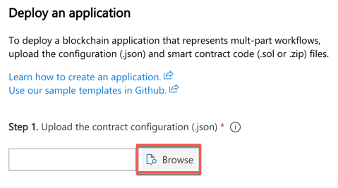

5. In the **Open** dialog, locate and select the **TelemetryCompliance.json** file, then click **Open**.

    

    >**Note**: When uploading the JSON file, it will be validated. If there are any errors in the file, they will display in a red box directly below the **Browse** button. If you have questions about the JSON Schema for Azure Blockchain Workbench, then refer to the [Azure Blockchain Workbench configuration reference](https://docs.microsoft.com/en-us/azure/blockchain-workbench/blockchain-workbench-configuration-overview) article within the documentation.
    >
    >
    >
    >You can also use the following tools to check the files for errors:
    >
    >- Test the Solidity (.sol) Smart Contract source code using the remix IDE available at <http://remix.ethereum.org>.
    >
    >- Test the JSON file using <http://jsoneditoronline.org>.

6. Click on the **Browse** button to **UPLOAD THE CONTRACT CODE (.sol, .zip)**, then choose the **TelemetryCompliance.sol** Solidity source code file for the Smart Contract.

    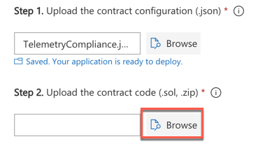

7. Once file validation passed for the uploaded files, click **Deploy** to deploy the Blockchain Application to the Azure Blockchain Workbench.

    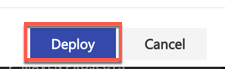

8. Once the Deployment is complete, you should see the **Telemetry Compliance** Blockchain Application in the list of Applications.

    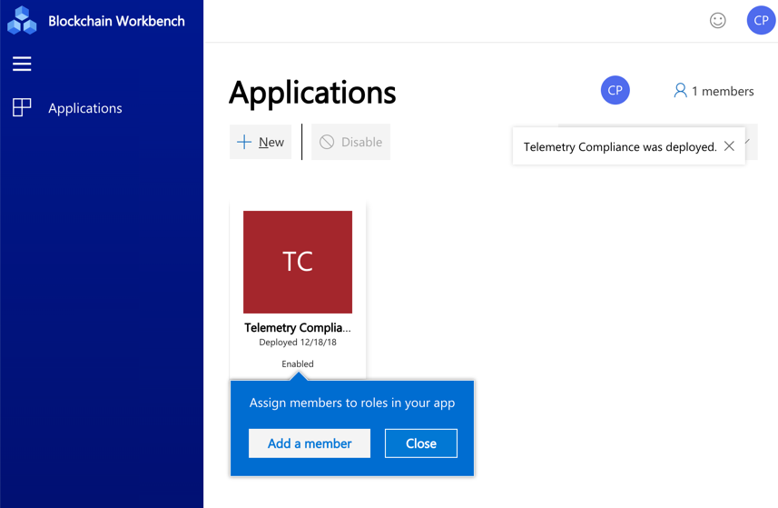

    > **NOTE:** The Blockchain application displays its version number; in this case it's v1.0. This versioning features allows for the contract to be updated with new versions as requirements changes over time.

## Exercise 5: Assign Users to Contract Personas

Duration: 15 minutes

In this exercise, the student will create some additional Users within Azure AD that correspond to the different user roles within the Blockchain solution. These Users will also be assigned to the different personas within the Azure Blockchain Workbench their roles within the workflow coincide with.

### Task 1: Create Users in Azure AD

1. Login to the Azure Portal at <http://portal.azure.com> using the credentials for your Azure Subscription.

2. Click on the **Directory and Subscription filter** button at the top of the Azure Portal, then select the **Northwind Traders** Azure AD Tenant that was created for this lab.

    

3. In the navigation on the left side of the Azure Portal, click on **Azure Active Directory**.

    

4. On the **Azure Active Directory** blade, click on **Users**.

    

5. Click **+New user** to begin adding a new user.

    

6. On the **User** blade, enter the following values:

    a.  Name: **Woodgrove Distribution**

    b.  User name: **woodgrovedistribution**@\<your-azure-ad-tenant\>.onmicrosoft.com.

    

7. Check the **Show Password** box, then **copy the password** for future reference.

    

8. Click **Create**.

    

9. Repeat the last couple steps to create the following additional users within Azure AD, and log in with them to the Blockchain Workbench Web Client so their accounts get created:

    | Name                              | User name
    | --------------------------------- | ---------------------------------
    | Contoso Shipping                  | **contososhipping**@\<your-azure-ad-tenant\>.onmicrosoft.com
    | Blockchain Shipping               | **blockchainshipping**@\<your-azure-ad-tenant\>.onmicrosoft.com
    | Simulated Device                  | **simulateddevice**@\<your-azure-ad-tenant\>.onmicrosoft.com
    | Northwind Traders Supplychain     | **northwindtraderssupplychain**@\<your-azure-ad-tenant\>.onmicrosoft.com
    | Government Regulator              | **governmentregulator**@\<your-azure-ad-tenant\>.onmicrosoft.com

    >**Note**: Be sure to record the passwords for each account so you can login with them later.

10. There should now be a total of **7 users** within the Northwind Traders Azure AD Directory. The 6 you just added, plus your Microsoft Account for managing the Azure AD Tenant and Azure Subscription:

    

### Task 2: Create User Assignments

1. Open a new browser window in incognito or private browser mode, then navigate to the URL for the **Blockchain Client App**.

2. When prompted, login to the site using your **Microsoft Account** that you previously added to the **Administrator** Group within Azure AD.

    

3. Once logged in, click the **Telemetry Compliance** Application.

    

4. On the **Telemetry Compliance** Application, click on the **members** link in the upper-right.

    

5. On the **Membership** pane, click the **Add a member** button.

    

6. On the **Add a member** pane, type the **Northwind Traders Supplychain** into the account name field, then click on and select that user from the suggested list of Users within Azure AD.

    

7. Select the **Role** of **User**, then click **Add**.

    

8. Repeat the previous couple of steps to add the following list of member users:

    | Member User Name               | Role |
    | ----------------               | ---- |
    | Woodgrove Distribution         | User |
    | Contoso Shipping               | User |
    | Blockchain Shipping            | User |
    | Simulated Device               | User |
    | Northwind Traders Supplychain  | User |
    | Government Regulator           | Auditor |

9. There should now be **6 Member Users** added.

    

## Exercise 6: Create and Process an Instance of the Smart Contract

Duration: 45 minutes

In this exercise, the student will create a new instance of the TelemetryCompliance Smart Contract, and work through the workflow of the Supply Chain as programmed in the code of the Smart Contract. The student will also test the Compliance piece by simulating IoT Device Telemetry by logging in as the "Simulated Device" user.

### Task 1: Create Contract Instance

1. Open a new browser in Incognito or Private browser mode, and navigate to the **Blockchain Workbench Web Client URL**.

    >**Note**: Since you just finished creating all the different user accounts, you need to make sure you log into the Blockchain Workbench web app with each login to setup each of the accounts in the Blockchain network. Also, since these accounts were just created, you'll need to wait a couple minutes for that setup to fully finish processing within the Blockchain network before continuing with this task.

2. Login as the **woodgrovedistribution** user.

    

3. Click the **Telemetry Compliance** application tile.

    

4. Click the **New Contract** button.

    

5. On the **Create** dialog, fill in the following values:

    a.  device: **Simulated Device**

    b.  supplyChainOwner: **Northwind Traders Supplychain**

    c.  supplyChainObserver: **Government Regulator**

    d.  minHumidity: **80**

    e.  maxHumidity: **90**

    f.  minTemperature: **40**

    g.  maxTemperature: **55**

    

6. Click **Create**.

7. Wait for the Contract to be created.

    

    >**Note**: This can take a few minutes to create the new Contract.

8. Once the Contract has been created, Click on the new Contract in the list.

    

9. When viewing the Smart Contract, scroll down to view the **Status** and **Details** panes. Notice that the **Status** shows as **Created**.

    

10. Scroll back up to the top of the page, click the **Take action** button.

    

11. In the **Action** dropdown, select **Request Transfer Responsibility**, then click **Take action**.

    

12. In the **newCounterparty** field, enter the **Contoso Shipping** user, then click **Take action**.

    

13. View that the **Actions** pane for the Smart Contract now show the message "*You took action Request Transfer Responsibility*".

    

14. Log out, and Close the browser.

### Task 2: Transfer Responsibility to Contoso Shipping

1. Open a new browser in Incognito or Private browser mode, and navigate to the **Blockchain Workbench Web Client URL**.

2. Login as the **contososhipping** user.

    

3. Click the **Telemetry Compliance** application tile.

    

4. Click the **Smart Contract** in the list.

    

5. Scroll down to the **Status** section and view that the Status is currently set to **TransitionRequestPending**.

    

6. Scroll back up to the top of the page, and click the **Take action** button.

    

7. In the Action dropdown, select **AcceptTransferResponsibility**, then click **Take action**.

    

8. Wait a minute or two for the responsibility transfer to process within the Blockchain.

9. Scroll down to the **Status** section, and view the Status is now set to **InTransit**.

    

10. Scroll back up to the top, and click the **Take action** button.

    

11. In the Action dropdown, select **Request Transfer Responsibility**, then click **Take action**.

    

12. In the **newCounterparty** field, select the **Blockchain Shipping** user, then click **Take action**.

    

13. Log out, and Close the browser.

### Task 3: Ingest Simulated Device Telemetry

1. Open a new browser in Incognito or Private browser mode, and navigate to the **Blockchain Workbench Web Client URL**.

2. Login as the **simulateddevice** user.

    

3. Click the **Telemetry Compliance** application tile.

    

4. Click the **Smart Contract** in the list.

    

5. Click the **Take action** button.

    

6. Select **Ingest Telemetry** in the Action dropdown, then click **Take action**.

    

7. On the **IngestTelemetry** dialog, enter the following values:

    a.  Humidity: **85**

    b.  Temperature: **48**

    

8. The **timestamp** field needs to be entered in as a **Unix Timestamp**. To easily get the Current Unix Timestamp, simply open a new browser, navigate to <http://www.unixtimestamp.com>, then copy the **Current Unix Timestamp** and paste it into the **timestamp** field within the **IngestTelemetry** dialog.

    

9. Once the **timestamp** has been entered, click **Take action**.

    

10. The **Simulated Device** for the package that the Smart Contract instance is tracking has now been logged and verified with the Smart Contract.

11. Log out, and Close the browser.

### Task 4: Accept Responsibility to Blockchain Shipping

1. Open a new browser in Incognito or Private browser mode, and .navigate to the **Blockchain Workbench Web Client URL**.

2. Login as the **blockchainshipping** user.

    

3. Click the **Telemetry Compliance** application tile.

    

4. Click on the **Smart Contract**.

    

5. Click the **Take action** button.

    

6. Select **AcceptTransferResponsibility** in the Action dropdown, then click **Take action**.

    

7. Wait a minute or two for the action to complete within the Blockchain.

8. Click the **Take action** button.

    

9. Select **Request Transfer Responsibility** in the Action dropdown, then click **Take action**.

    

10. In the **newCounterparty** field, select the **Northwind Traders Supplychain** user, then click **Take action**.

    

11. Log out, and Close the browser.

### Task 5: Final Delivery to Northwind Traders

1. Open a new browser in Incognito or Private browser mode, and navigate to the **Blockchain Workbench Web Client URL**.

2. Login as the **northwindtraderssupplychain** user.

    

3. Click the **Telemetry Compliance** application tile.

    

4. Click on the **Smart Contract**.

    

5. Click the **Take action** button.

    

6. Select **AcceptTransferResponsibility** in the Action dropdown, then click **Take action**.

    

7. Wait a minute or two for the Blockchain network to process.

8. Click the **Take action** button.

    

9. Select **TakeFinalDelivery** in the Action dropdown, then click **Take action**.

    

10. Wait a minute or two for the Blockchain network to process.

11. Log out, and Close the browser.

### Task 6: Audit Smart Contract for Compliance

1. Open a new browser in Incognito or Private browser mode, and navigate to the **Blockchain Workbench Web Client URL**.

2. Login as the **governmentregulator** user.

    

3. Click the **Telemetry Compliance** application tile.

    

4. Click on the **Smart Contract** in the list.

    

5. Scroll down and view the information displayed in the **Status**, **Details**, and **Activity** sections for the Smart Contract.

    

6. Log out, and Close the browser.

## After the hands-on lab

Duration: 15 minutes

### Task 1: Delete Resources

1. Now that the Lab is complete, go ahead and delete all the Resource Groups that were created for this Lab. You will no longer need those resources and it will be beneficial to clean up your Azure Subscription.

### Task 2: Delete Azure AD Tenant

>**Note:** Only follow this task if you created a new Azure AD tenant just to use for this lab. If you used an existing Azure AD tenant to manage the user accounts for this lab, then DO NOT delete it.

1. Open a browser window / tab, then navigate to and login to the Azure Portal at <http://portal.azure.com>.

2. Click on the **Directory and Subscription filter** button in the top menu of the Azure Portal, and select the **Northwind Traders** Azure AD directory.

    

3. In the navigation pane on the left, click on **Azure Active Directory**.

    

4. Before the Azure AD Tenant can be deleted, it first needs to be cleaned up.

5. On the Azure Active Directory blade, click on **Users**.

    

6. Go through and **Delete** each of the Users that were created for this lab.

    

7. On the **Azure Active Directory** blade, click on **App registrations**.

    

8. Click the **View all application** button to show all application registration.

9. Click on the **Azure Blockchain Workbench Web Client** app registration.

    

10. Click the **delete** button, and click **Yes** to confirm deleting the app registration.

    

11. On the **Azure Active Directory** blade, click **Delete directory** button, and click the **Delete** button on the **Delete directory 'Northwind Traders'?** confirmation pane.

    

You should follow all steps provided *after* attending the hands-on lab.
