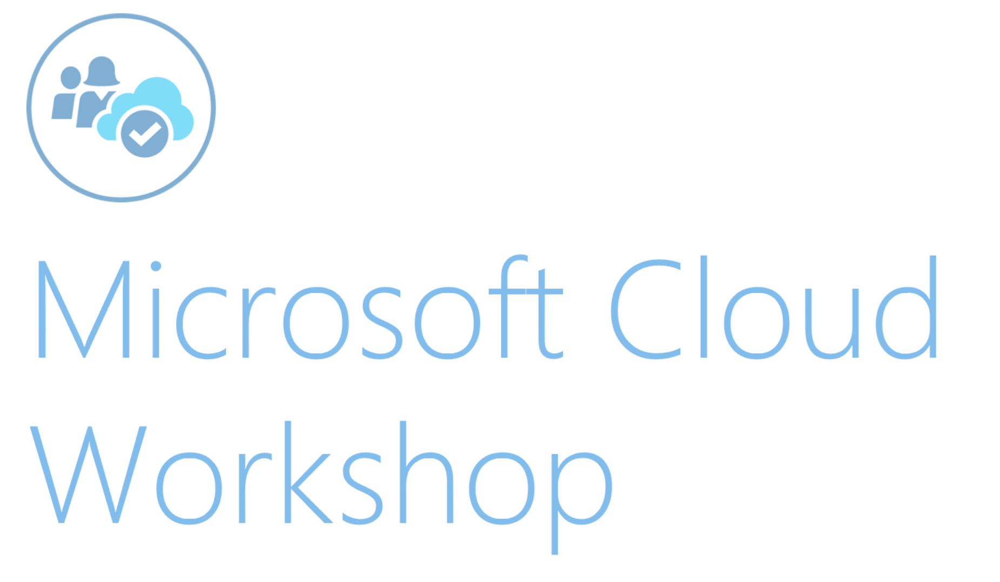

Azure Blockchain

Whiteboard design session student guide

June 2018

Information in this document, including URL and other Internet Web site references, is subject to change without notice. Unless otherwise noted, the example companies, organizations, products, domain names, e-mail addresses, logos, people, places, and events depicted herein are fictitious, and no association with any real company, organization, product, domain name, e-mail address, logo, person, place or event is intended or should be inferred. Complying with all applicable copyright laws is the responsibility of the user. Without limiting the rights under copyright, no part of this document may be reproduced, stored in or introduced into a retrieval system, or transmitted in any form or by any means (electronic, mechanical, photocopying, recording, or otherwise), or for any purpose, without the express written permission of Microsoft Corporation.

Microsoft may have patents, patent applications, trademarks, copyrights, or other intellectual property rights covering subject matter in this document. Except as expressly provided in any written license agreement from Microsoft, the furnishing of this document does not give you any license to these patents, trademarks, copyrights, or other intellectual property.

The names of manufacturers, products, or URLs are provided for informational purposes only and Microsoft makes no representations and warranties, either expressed, implied, or statutory, regarding these manufacturers or the use of the products with any Microsoft technologies. The inclusion of a manufacturer or product does not imply endorsement of Microsoft of the manufacturer or product. Links may be provided to third party sites. Such sites are not under the control of Microsoft and Microsoft is not responsible for the contents of any linked site or any link contained in a linked site, or any changes or updates to such sites. Microsoft is not responsible for webcasting or any other form of transmission received from any linked site. Microsoft is providing these links to you only as a convenience, and the inclusion of any link does not imply endorsement of Microsoft of the site or the products contained therein.

© 2018 Microsoft Corporation. All rights reserved.

Microsoft and the trademarks listed at <https://www.microsoft.com/en-us/legal/intellectualproperty/Trademarks/Usage/General.aspx> are trademarks of the Microsoft group of companies. All other trademarks are property of their respective owners.

**Contents**

<!-- TOC -->

- [Azure Blockchain whiteboard design session student guide](#azure-blockchain-whiteboard-design-session-student-guide)
    - [Abstract and learning objectives](#abstract-and-learning-objectives)
    - [Step 1: Review the customer case study](#step-1-review-the-customer-case-study)
        - [Facilitator/subject matter expert (SME) presentation of customer case study](#facilitatorsubject-matter-expert-sme-presentation-of-customer-case-study)
        - [Customer situation](#customer-situation)
        - [Customer needs](#customer-needs)
        - [Customer objections](#customer-objections)
        - [Infographic for common scenarios](#infographic-for-common-scenarios)
    - [Step 2: Design a proof of concept solution](#step-2-design-a-proof-of-concept-solution)
    - [Step 3: Present the solution](#step-3-present-the-solution)
    - [Wrap-up](#wrap-up)
    - [Additional references](#additional-references)

<!-- /TOC -->

# Azure Blockchain whiteboard design session student guide

## Abstract and learning objectives

Students will learn how to build and configure an Internet of Things (IoT) Audit Solution using Azure Blockchain. Students will do this using Ethereum Blockchain with the use of Smart Contracts to collect device telemetry information in addition to enforce contract specifics related to conditions during transport of goods. Specifically, the IoT devices will report temperature and humidity data that will be validated through the Smart Contracts against agreed upon acceptable ranges.

Students will learn how to:

- Deploy and Configure Azure Blockchain Workbench

- Write and Deploy Ethereum Smart Contracts with Solidity

- Integrate both IoT and Blockchain together into a single solution

## Step 1: Review the customer case study 

**Outcome**

Analyze your customer's needs.

### Facilitator/subject matter expert (SME) presentation of customer case study 

Timeframe: 15 minutes

Directions: With all participants in the session, the facilitator/SME presents an overview of the customer case study along with technical tips.

1. Meet your table participants and trainer.

2. Read all of the directions for Steps 1--3 in the Student guide.

3. As a table team, review the following customer case study.

### Customer situation

Northwind Traders is the world's largest food and beverage company. The company has a long history of innovation since its founding more than 150 years ago. Over the last few years, Northwind has been increasing their emphasis on tracking their products from the origin of the raw materials all way through the manufacturing process to the consumer. They pride themselves on being able to certify both the origin and delivery of their products with high accuracy.

With multiple shipping companies and methods, from trucks, to trains, to ships, it is very difficult to guarantee traceability and accuracy of the shipping data. It is also very difficult to avoid inefficiencies and profit losses. The CEO of Northwind Traders, John Adams, states, "The solution to guaranteeing the quality of our products health is complete control of the supply chain."

Coordinating the traceability and accuracy of shipping information across the supply chain is a complex task that requires cooperation and coordination between many different companies and government organizations. Northwind Traders has spent a lot of resources and money to guarantee the accuracy of this data over the years, as well as the security and privacy of the data. Over the years this has required the coordination across languages, and political boundaries, in addition to the efforts of the many different companies involved.

Jill Anders, the CTO of Northwind Traders has reached out to you to help them build a truly innovative solution to better track their shipments. Jill says, "We need a system that is more secure, more efficient, and will help us lower, not just IT costs, but other costs across the organization." They've heard of Blockchain and Smart Contract technologies, and are thinking these may help them solve this problem.

As the most innovative company in their industry, they do implement Internet of Things (IoT) devices to track product storage and shipment. They do this mostly using temperature and humidity sensors mounted within warehouses and shipping containers. While this is something that's easy to implement on Northwind Traders properties, it can be difficult to implement across all shipping partners, distributors, and other entities involved. They are looking to additionally integrate these IoT Sensors into their entire supply chain tracking to better increase the level of transparency and traceability of shipping data.

The Northwind Traders engineering team is currently working on adding additional sensor support to the IoT tracking devices they are planning to deploy in the near future. With tracking shipments, a key feature they are working on is the addition of GPS (Global Positioning System) sensors to better enable them to track package locations in real-time. They are also looking to augment some of their IoT devices with Cellular-based Internet connectivity, in addition to Wifi.

Regarding better transparency and traceability of their products, as well as origin materials, the CEO of Northwind Traders, says "I wish we could better track the environment information while our shipments are in the hands of Customs and other Government organizations. It would also help to have a better view into our resellers too." The overall tracking of shipments is a major concern for the company. They want to better track shipments, not just for insurance and quality control reasons, but also so they can better guarantee where supplies are and who's handling them as they flow through the system from raw material to final product sold to consumers.

### Customer needs

1. A more seamless system is needed to manage the supply chain, all the way from farmer to consumer

2. Easy audit transparency is an important feature, as Northwind Traders needs to coordinate with Customs and other political organizations with ease

3. The system needs to have immutability of data built as a core feature, to prevent fraud, intentional or otherwise, by partners and third-parties. This will ease audits for regulatory and insurance needs

4. The Blockchain implementation needs to be secure and fully under the control of Northwind Traders; while simultaneously integrating with partners and third-parties when managing the supply chain

5. Both new and existing IoT device sensors need to be integrated to ensure the highest quality shipping conditions are maintained; in addition to tracking locations as necessary

### Customer objections

1. There's tons of buzz about Blockchain, and we only understand enough to know it could be useful. We heard it's extremely expensive to implement and/or built a POC (Proof of Concept) solution. Is this true?

2. We've heard Azure Blockchain Workbench uses the Ethereum cryptocurrency. This really doesn't seem like the secure solution we need if our data will be out on the public Ethereum Blockchain that anyone can access.

3. When adopting Blockchain and Smart Contract technologies, what does the learning curve look like for your development team?

4. How are user accounts or Blockchain wallets managed within Azure Blockchain Workbench? We really need to make sure we have complete control over the security of the entire system.

5. We will have a mixture of IoT devices connecting to the network over either Wifi or Cellular connections. Will it be an issue to integrate these devices and their sensor data with Azure Blockchain Workbench?

6. Is Azure AD really needed? We already have another directory service solution in place. We can't change it simply because we want to leverage Blockchain!

### Infographic for common scenarios

**IoT / Big Data Lambda Architecture**

**Blockchain Ledger**

<https://github.com/Azure/azure-blockchain-projects/blob/master/bletchley/bletchley-whitepaper.md>

## Step 2: Design a proof of concept solution

**Outcome**

Prepare to present a solution to the target customer audience in a 15-minute chalk-talk format.

Timeframe: 60 minutes

**Business needs**

Directions: With all participants at your table, answer the following questions and list the answers on a flip chart.

1. Who should you present this solution to? Who is your target customer audience? Who are the decision makers?

2. What customer business needs do you need to address with your solution?

**Design**

Directions: With all participants at your table, respond to the following questions on a flip chart.

**Design the Blockchain Solution**

1. What Azure services are to be used to build the Blockchain solution?

2. What Blockchain technologies will be used for the Blockchain ledger and Smart Contracts?

3. How would you answer the customer objections?

4. Come up with a high-level architecture design for the Blockchain solution that meets all the customers' needs.

**Design the IoT (Internet of Things) device and sensor integration**

1. What Azure services are to be used to integrate the IoT devices / sensors with the Blockchain solution?

2. How would you answer the customer objections?

3. Come up with a high-level architecture design for the IoT solution necessary to integrate with the Blockchain solution.

**Prepare**

Directions: With all participants at your table:

1. Identify any customer needs that are not addressed with the proposed solution

2. Identify the benefits of your solution

3. Determine how you will respond to the customer's objections

Prepare for a 15-minute chalk-talk style presentation to the customer.

## Step 3: Present the solution

**Outcome**

Present a solution to the target customer audience in a 15-minute chalk-talk format.

**Presentation**

Timeframe: 30 minutes

**Directions**

1. Pair with another table.

2. One table is the Microsoft team and the other table is the customer.

3. The Microsoft team presents their proposed solution to the customer.

4. The customer makes one of the objections from the list of objections.

5. The Microsoft team responds to the objection.

6. The customer team gives feedback to the Microsoft team.

7. Tables switch roles and repeat Steps 2--6.

## Wrap-up

Timeframe: 15 minutes

- Tables reconvene with the larger group to hear a SME share the preferred solution for the case study.

## Additional references

| **Description **                  | > **Links **                      |
| --------------------------------- | ----------------------------------|
| What is Azure Active Directory?   | <https://docs.microsoft.com/en-us/azure/active-directory/active-directory-whatis> |
| Get started with Azure AD         | <https://docs.microsoft.com/en-us/azure/active-directory/get-started-azure-ad> |
| Create a group and add members in Azure Active Directory | <https://docs.microsoft.com/en-us/azure/active-directory/active-directory-groups-create-azure-portal> |
| How to Use SSH keys with Windows on Azure  | <https://docs.microsoft.com/en-us/azure/virtual-machines/linux/ssh-from-windows> |
| Using PuTTY gen, the PuTTY key generator    | <https://the.earth.li/~sgtatham/putty/0.70/htmldoc/Chapter8.html#pubkey-puttygen> |
| Solidity Documentation            | <https://solidity.readthedocs.io/en/develop/index.html> |
| Remix -- Solidity IDE             | <http://remix.ethereum.org>       |
| A Simple Smart Contract           | <https://solidity.readthedocs.io/en/develop/introduction-to-smart-contracts.html#a-simple-smart-contract> |
| Quickstart: Add new users to Azure Active Directory      | <https://docs.microsoft.com/en-us/azure/active-directory/add-users-azure-active-directory> |
| Manage group membership for users in your Azure Active Directory tenant | <https://docs.microsoft.com/en-us/azure/active-directory/active-directory-groups-members-azure-portal> |
